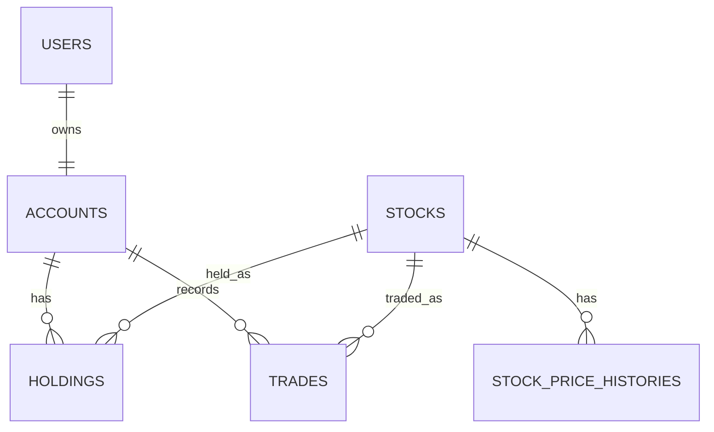

# Virtuber

Spring Boot 기반 주식 모의투자 REST API 프로젝트입니다. 회원가입 시 가상 계좌와 시드머니를 자동으로 지급하고, 사용자는 미리 등록된 종목을 조회한 뒤 매수/매도하며 계좌와 거래 내역을 확인할 수 있습니다.

## 주요 기능

- JWT 기반 회원가입, 로그인, 토큰 재발급, 로그아웃
- 회원가입 시 계좌 자동 생성 및 시드머니 10,000,000원 지급
- 내 계좌 조회: 현금 잔고, 총 매입금액, 평가금액, 총 자산, 평가손익, 수익률, 보유 종목 목록
- 계좌 초기화: 비밀번호 재확인 후 보유 주식과 거래 내역 삭제, 시드머니 복구
- 주식 목록 조회 및 초기 종목 데이터 등록
- 매수/매도 처리와 거래 내역 저장
- 매도 시 실현손익 및 실현 수익률 기록
- 비관적 락을 이용한 계좌 단위 동시성 제어
- 스케줄러 기반 주식 현재가 변동 및 가격 이력 저장
- Swagger UI 기반 API 문서 제공

## 기술 스택

| 영역 | 기술 |
| --- | --- |
| Language | Java 17 |
| Framework | Spring Boot 3.5.14 |
| Web | Spring Web |
| ORM | Spring Data JPA |
| Security | Spring Security, JWT |
| Validation | Bean Validation |
| Database | MySQL 8.4, H2 |
| Test | JUnit 5, AssertJ, Testcontainers |
| Docs | springdoc-openapi Swagger UI |
| Build | Gradle |

## 프로젝트 구조

```text
src
├── main
│   ├── java/org/example/virtuber
│   │   ├── account      # 계좌 조회, 초기화, 계좌 엔티티/DTO/Repository/Service
│   │   ├── auth         # 회원가입, 로그인, 토큰 재발급, 로그아웃
│   │   ├── common       # 공통 응답, 예외 처리, 에러 코드
│   │   ├── security     # Spring Security, JWT 필터/토큰 제공자
│   │   ├── stock        # 종목 조회, 주가 변동 스케줄러, 가격 이력
│   │   ├── trade        # 매수/매도, 보유 종목, 거래 내역
│   │   └── user         # 사용자 엔티티/Repository
│   └── resources
│       ├── application.yaml
│       └── data.sql     # 초기 종목 데이터
└── test
    ├── java/org/example/virtuber
    │   ├── account
    │   ├── auth
    │   ├── support      # Testcontainers 기반 통합 테스트 지원
    │   └── trade
    └── resources/application-test.yaml
```

## 실행 환경

- Java 17
- Docker 또는 로컬 MySQL 8.x
- 기본 서버 포트: `8000`
- 기본 DB: `virtuber`

`application.yaml`의 기본 DB 접속 정보는 다음과 같습니다.

```yaml
spring:
  datasource:
    url: jdbc:mysql://localhost:3306/virtuber?serverTimezone=Asia/Seoul&characterEncoding=UTF-8
    username: root
    password: 11111111
```

JWT Secret은 환경 변수로 덮어쓸 수 있습니다.

```bash
JWT_SECRET=your-very-long-secret
```

## 실행 방법

MySQL 컨테이너를 실행합니다.

```bash
docker compose up -d
```

애플리케이션을 실행합니다.

```bash
./gradlew bootRun
```

Windows PowerShell에서는 다음 명령을 사용할 수 있습니다.

```powershell
.\gradlew.bat bootRun
```

애플리케이션이 실행되면 아래 주소에서 접근할 수 있습니다.

- API Base URL: `http://localhost:8000`
- Swagger UI: `http://localhost:8000/swagger-ui/index.html`
- OpenAPI Docs: `http://localhost:8000/v3/api-docs`

## 테스트

테스트는 Testcontainers로 MySQL 8.4 컨테이너를 띄워 실행합니다. Docker가 실행 중이어야 합니다.

```bash
./gradlew test
```

Windows PowerShell:

```powershell
.\gradlew.bat test
```

현재 포함된 주요 테스트는 다음과 같습니다.

- 회원가입 성공 시 사용자 저장 및 계좌 자동 생성
- 중복 ID 회원가입 실패
- 로그인 성공 및 Access/Refresh Token 발급
- 로그인 실패 케이스
- 계좌 조회 시 보유 주식 포함
- 계좌 초기화 시 시드머니 복구, 보유 주식 삭제, 거래 내역 삭제
- 매수 성공, 잔고 부족 실패, 추가 매수 평균 매입가 재계산
- 매도 성공, 보유 수량 부족 실패, 전량 매도 시 Holding 삭제
- 동시 매수/매도 요청 시 잔고와 보유 수량 정합성 보장

## 초기 데이터

서버 시작 시 `data.sql`을 통해 다음 종목이 등록됩니다.

| 종목 코드 | 종목명 | 현재가 |
| --- | --- | ---: |
| 005930 | 삼성전자 | 78,000 |
| 000660 | SK하이닉스 | 180,000 |
| 035420 | NAVER | 180,000 |
| 035720 | 카카오 | 45,000 |
| 005380 | 현대차 | 250,000 |
| 373220 | LG에너지솔루션 | 350,000 |

주식 가격은 스케줄러를 통해 기본 10초마다 변동되며, 변동 폭은 `application.yaml`의 `stock.price-update` 설정으로 조정할 수 있습니다.

```yaml
stock:
  price-update:
    fixed-delay-ms: 10000
    initial-delay-ms: 5000
    min-rate: -0.01
    max-rate: 0.01
```

## 인증 방식

로그인 성공 시 Access Token과 Refresh Token을 발급합니다. 인증이 필요한 API는 `Authorization` 헤더에 Bearer Token을 전달해야 합니다.

```http
Authorization: Bearer {accessToken}
```

회원가입, 로그인, 토큰 재발급, 로그아웃, 주식 목록 조회, Swagger 문서는 인증 없이 접근할 수 있습니다.

## 공통 응답 형식

성공 응답:

```json
{
  "success": true,
  "data": {},
  "message": "요청 처리에 성공했습니다.",
  "error": null,
  "timestamp": "2026-06-22T15:30:00"
}
```

실패 응답:

```json
{
  "success": false,
  "data": null,
  "message": null,
  "error": {
    "code": "CMN_002",
    "message": "입력값이 올바르지 않습니다.",
    "details": [
      {
        "field": "quantity",
        "reason": "수량은 1주 이상이어야 합니다."
      }
    ]
  },
  "timestamp": "2026-06-22T15:30:00"
}
```

## API 목록

| Method | Endpoint | 인증 | 설명 |
| --- | --- | --- | --- |
| POST | `/api/v1/auth/signup` | 불필요 | 회원가입 |
| POST | `/api/v1/auth/signin` | 불필요 | 로그인 |
| POST | `/api/v1/auth/reissue` | 불필요 | Access Token 재발급 |
| POST | `/api/v1/auth/signout` | 불필요 | 로그아웃 |
| GET | `/api/v1/accounts/me` | 필요 | 내 계좌 조회 |
| PUT | `/api/v1/accounts/me/init` | 필요 | 내 계좌 초기화 |
| GET | `/api/v1/stocks` | 불필요 | 주식 목록 조회 |
| POST | `/api/v1/trades/buy` | 필요 | 매수 |
| POST | `/api/v1/trades/sell` | 필요 | 매도 |
| GET | `/api/v1/trades` | 필요 | 내 거래 내역 조회 |

## API 예시

### 회원가입

```http
POST /api/v1/auth/signup
Content-Type: application/json
```

```json
{
  "userId": "zero",
  "password": "password1234!"
}
```

응답:

```json
{
  "success": true,
  "data": {
    "id": 1,
    "userId": "zero",
    "cashBalance": 10000000
  },
  "message": "회원가입에 성공했습니다.",
  "error": null,
  "timestamp": "2026-06-22T15:30:00"
}
```

### 로그인

```http
POST /api/v1/auth/signin
Content-Type: application/json
```

```json
{
  "userId": "zero",
  "password": "password1234!"
}
```

응답:

```json
{
  "success": true,
  "data": {
    "id": 1,
    "userId": "zero",
    "accessToken": "eyJ...",
    "refreshToken": "eyJ..."
  },
  "message": "로그인에 성공했습니다.",
  "error": null,
  "timestamp": "2026-06-22T15:30:00"
}
```

### 토큰 재발급

```http
POST /api/v1/auth/reissue
Content-Type: application/json
```

```json
{
  "refreshToken": "eyJ..."
}
```

응답:

```json
{
  "success": true,
  "data": {
    "accessToken": "eyJ..."
  },
  "message": "Access Token 재발급에 성공했습니다.",
  "error": null,
  "timestamp": "2026-06-22T15:30:00"
}
```

### 로그아웃

```http
POST /api/v1/auth/signout
Content-Type: application/json
```

```json
{
  "refreshToken": "eyJ..."
}
```

### 주식 목록 조회

```http
GET /api/v1/stocks
```

응답:

```json
{
  "success": true,
  "data": [
    {
      "stockId": 1,
      "stockCode": "005930",
      "stockName": "삼성전자",
      "currentPrice": 78000,
      "upPrice": 101400,
      "lowPrice": 54600,
      "companyInfo": "삼성전자는 반도체, 스마트폰, 가전 등을 생산하는 국내 대표 기업입니다.",
      "financialInfo": "매출과 영업이익이 반도체 업황에 큰 영향을 받습니다."
    }
  ],
  "message": "종목 목록 조회에 성공했습니다.",
  "error": null,
  "timestamp": "2026-06-22T15:30:00"
}
```

### 내 계좌 조회

```http
GET /api/v1/accounts/me
Authorization: Bearer {accessToken}
```

응답:

```json
{
  "success": true,
  "data": {
    "cashBalance": 9220000,
    "totalPurchaseAmount": 780000,
    "stockEvaluationAmount": 780000,
    "totalAssetAmount": 10000000,
    "profitAmount": 0,
    "profitRate": 0.0,
    "holdings": [
      {
        "stockId": 1,
        "stockCode": "005930",
        "stockName": "삼성전자",
        "quantity": 10,
        "averagePrice": 78000,
        "currentPrice": 78000,
        "totalPurchaseAmount": 780000,
        "evaluationAmount": 780000,
        "profitAmount": 0,
        "profitRate": 0.0
      }
    ]
  },
  "message": "계좌 조회에 성공했습니다.",
  "error": null,
  "timestamp": "2026-06-22T15:30:00"
}
```

### 계좌 초기화

```http
PUT /api/v1/accounts/me/init
Authorization: Bearer {accessToken}
Content-Type: application/json
```

```json
{
  "password": "password1234!"
}
```

응답:

```json
{
  "success": true,
  "data": {
    "cashBalance": 10000000,
    "holdingsCount": 0
  },
  "message": "계좌 초기화에 성공했습니다.",
  "error": null,
  "timestamp": "2026-06-22T15:30:00"
}
```

### 매수

```http
POST /api/v1/trades/buy
Authorization: Bearer {accessToken}
Content-Type: application/json
```

```json
{
  "stockId": 1,
  "quantity": 10
}
```

응답:

```json
{
  "success": true,
  "data": {
    "tradeId": 1,
    "tradeType": "BUY",
    "stockId": 1,
    "stockName": "삼성전자",
    "quantity": 10,
    "price": 78000,
    "totalAmount": 780000,
    "cashBalance": 9220000,
    "tradedTime": "2026-06-22T15:30:00"
  },
  "message": "매수 완료",
  "error": null,
  "timestamp": "2026-06-22T15:30:00"
}
```

### 매도

```http
POST /api/v1/trades/sell
Authorization: Bearer {accessToken}
Content-Type: application/json
```

```json
{
  "stockId": 1,
  "quantity": 5
}
```

응답:

```json
{
  "success": true,
  "data": {
    "tradeId": 2,
    "tradeType": "SELL",
    "stockId": 1,
    "stockName": "삼성전자",
    "quantity": 5,
    "price": 78000,
    "totalAmount": 390000,
    "cashBalance": 9610000,
    "averagePriceBeforeSell": 78000,
    "sellProfitAmount": 0,
    "sellProfitRate": 0.0,
    "tradedTime": "2026-06-22T15:35:00"
  },
  "message": "매도 완료",
  "error": null,
  "timestamp": "2026-06-22T15:35:00"
}
```

### 거래 내역 조회

```http
GET /api/v1/trades
Authorization: Bearer {accessToken}
```

최신 거래순으로 반환됩니다. 매수 거래는 매도 관련 필드가 `null`이므로 JSON 응답에서 제외됩니다.

## 도메인 모델



핵심 엔티티:

- `User`: 로그인 ID와 암호화된 비밀번호를 저장합니다.
- `Account`: 사용자별 계좌, 현금 잔고, 시드머니를 저장합니다.
- `Stock`: 종목 코드, 종목명, 현재가, 상한가/하한가, 회사/재무 정보를 저장합니다.
- `Holding`: 계좌별 보유 종목, 수량, 평균 매입가를 저장합니다.
- `Trade`: 매수/매도 거래 내역, 거래가, 거래 시각, 매도 실현손익을 저장합니다.
- `StockPriceHistory`: 스케줄러가 기록한 종목별 가격 변동 이력을 저장합니다.
- `RefreshToken`: 사용자별 Refresh Token과 만료 시각을 저장합니다.

## 정합성 처리

매수, 매도, 계좌 초기화는 모두 트랜잭션 안에서 처리됩니다.

- 매수: 계좌 조회 및 락 획득, 종목 조회, 현금 차감, Holding 생성/수정, Trade 저장
- 매도: 계좌 조회 및 락 획득, 보유 수량 검증, 현금 증가, Trade 저장, 수량 0일 때 Holding 삭제
- 계좌 초기화: 비밀번호 검증, 계좌 락 획득, Holding 삭제, Trade 삭제, 현금 잔고 초기화

계좌 변경 API는 `AccountRepository.findByUserIdForUpdate`에서 `PESSIMISTIC_WRITE` 락을 사용해 같은 계좌에 대한 동시 요청을 순차 처리합니다.

## 주요 에러 코드

| 코드 | 설명 |
| --- | --- |
| `AUTH_001` | 이미 사용 중인 ID |
| `AUTH_002` | ID 또는 비밀번호 불일치 |
| `AUTH_003` | 인증되지 않은 사용자 |
| `AUTH_005` | 유효하지 않은 토큰 |
| `USER_001` | 존재하지 않는 사용자 |
| `ACCOUNT_001` | 존재하지 않는 계좌 |
| `STOCK_001` | 존재하지 않는 종목 |
| `TRADE_001` | 현금 잔고 부족 |
| `TRADE_002` | 매도 수량이 보유 수량을 초과 |
| `CMN_001` | 접근 권한 없음 |
| `CMN_002` | 입력값 검증 실패 |
| `CMN_500` | 서버 내부 오류 |

## 요구사항 문서

상세 요구사항과 API 명세 초안은 프로젝트 루트의 [Virtuber-요구사항-기술스택-API명세.md](./Virtuber-%EC%9A%94%EA%B5%AC%EC%82%AC%ED%95%AD-%EA%B8%B0%EC%88%A0%EC%8A%A4%ED%83%9D-API%EB%AA%85%EC%84%B8.md)에서 확인할 수 있습니다.
